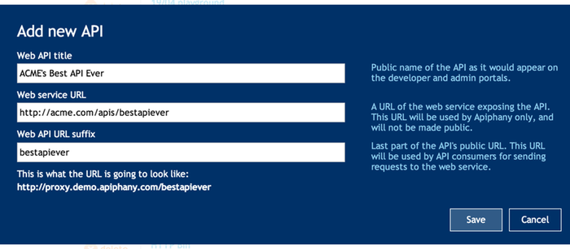
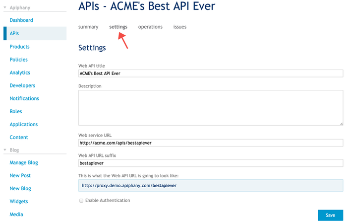
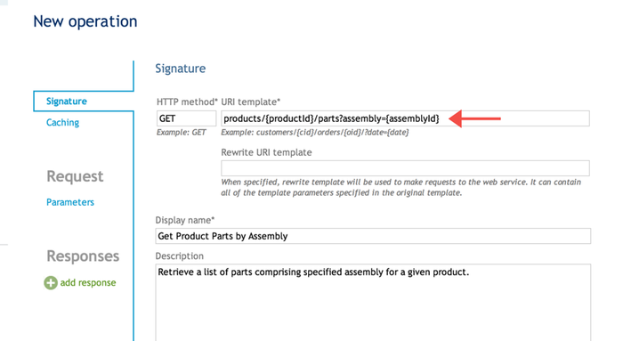
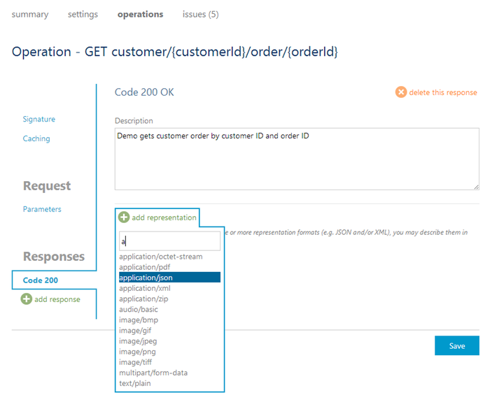

#Tech Note 1: How to publish an API

## Summary
This is a step-by-step guide explaining how to register and describe an API, add it to the newly created product, and publish it to the Web.

## Adding an API

In order to add an API you must either sign in or register first. See the Tech Note on sign up and registration for more information. 

1. Sign into your account.

1. Select the **Dashboard** link to access your developer portal:

1. Select the **APIs** menu option on the left and click on the **add API** button. 

1. The *Add new API* popup window will be displayed. 

1. Provide values for the three fields (all required) on the *Add new API* popup window.
	- **Web API title** provides a unique and descriptive name for the API. It is displayed in many places on the developer and administrative portals.
	- **Web service URL** references HTTP service implementing the API. Apiphany platform will forward API requests to this address.
	- **Web API URL suffix** is appended to the base URL. Base URL is common for all APIs hosted on the Apiphany platform by the API publisher. It can be viewed under the last input box. Apiphany platform distinguishes APIs by their suffix and therefore it must be unique for every API for a given publisher. 

1. Once you have successfully made all of your entries click **Save**.
 
## Changing API Settings

1. The **settings** section allows you to verify and edit the information you just entered. 

2. You can optionally configure HTTP Basic Authentication for the web service implementing the API by checking the **Enable Authentication** checkbox and entering credentials. 
 
## Configuring API Operations

###  Operation signature
1. Select your API by clicking on the **APIs** link in the menu, or, if you were in the process of creating an API then select **operations**: 

2. Click the **add operation** button to add a new operation. The *New operation* window will be displayed and the *Signature* tab will be selected by default. 

3. Specify HTTP method by placing cursor in the *HTTP method* input and selecting one of HTTP methods from the drop down list. 
 
4. Define the *URI template* by typing in a URL fragment consisting of one or more URL path segments and zero or more query string parameters. URI template, appended to the base URL of the API, identifies a single HTTP operation. It may contain one or more named variable parts that are identified by curly braces. These variable parts are called template parameters and are dynamically assigned values extracted from the request's URL when the request is being processed by the Apiphany platform.

5. Optionally, specify the *Rewrite URI template*. Template parameters from the URI template should be used in the rewrite template. URL of the incoming operation request will be converted into a URL that would be forwarded to the web service that implements the API according to the URL - rewrite URL mapping. The following example shows how content type encoded as path segment in the web service can be provided as a query parameter in the API published via APiphany using the URI templates.
	
	URI template:`/orders?format={contentType}`
	
	Rewrite URI template:`/{contentType}/orders`
	
	Request URL `.../orders?format=xml` is mapped to `.../xml/orders`

5. Enter a descriptive name for the operation in the *Display name* text box.

6. Operation description can be specified as plain text or HTML in the *Description* text box.
 
### Operation Caching
Response caching reduces latency perceived by the API consumers, lowers bandwidth consumption and decreases the load on the HTTP web service implementing the API. Note that comprehensive caching settings are available via the *Policy* page.
 
1. To easily and quickly enable caching for the operation, select the *Caching* tab and check the **Enable** checkbox. 

2. In the *Duration* text box, change the time period during which cached responses remain fresh and are served from cache. Default value is 3600 second or 1 hour.

3. Optionally, enter specific query string parameters and/or HTTP headers to be used in computing cache key values in the *Vary by string parameters* and *Vary by headers* text boxes respectively. When none specified, full request URL and the following HTTP header values are used in cache key generation: `Accept` and `Accept-Charset`. 

### Request Parameters
Operation parameters are managed on the *Parameters* tab. Parameters specified in the URL Template on the [*Signature tab*](#url_template) are added automatically and can be changed only by editing the *URL template*. Additional parameters can be entered manually.

To add a new query parameter, click **add query parameter** and enter the following information:

- *Name* - parameter name.

- *Description* - a brief description of the parameter (optional).

- *Type* - parameter type, selected in the drop down.

- *Values* - values that can be assigned to this parameter. One of the values can be marked as default (optional).

- *Required* - make the parameter mandatory by checking the checkbox. 

### Request Body
If the operation allows (e.g. PUT, POST) and requires a body you may provide an example of it in all of the supported representation formats (e.g. json, XML). 

1. Switch to the *Body* tab.

2. Click **add representation**, start typing desired content type name (e.g. `application/json`) and then select it in the drop down.

3. Paste request body example in the selected format into the text box. 

4. Add description (optional).

### Responses
It is a good practice to provide examples of responses for all status codes that the operation may produce. Each status code may have more than one response body example, one for each of the supported content types. For instance, to add an example of `200 OK` response perform the following steps:

1. Click on **add response**, start typing desired status code (e.g. `200 OK` in the text box, then select it in the drop down; The *Code 200* tab is created and selected.

2. Click **add representation** start typing desired content type name (e.g. `application/json`) and then select it in the drop down. 

3. Paste request body example in the selected format into the text box.  

4. Add description (optional).

Do not forget to click **Save** button to persist the changes.

Please provide feedback or request assistance by sending an email to [support@apiphany.com](mailto:support@apiphany.com).
