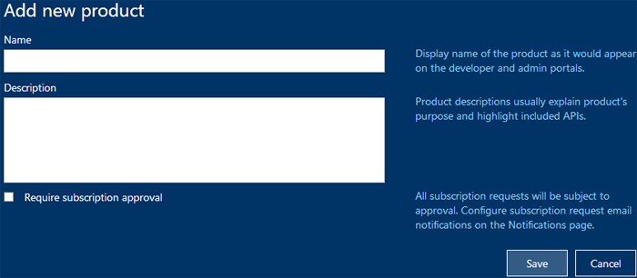
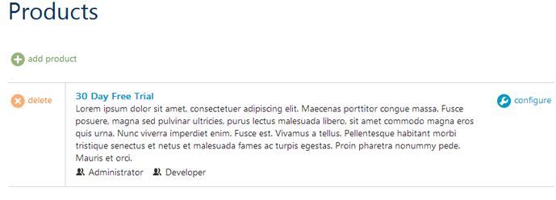
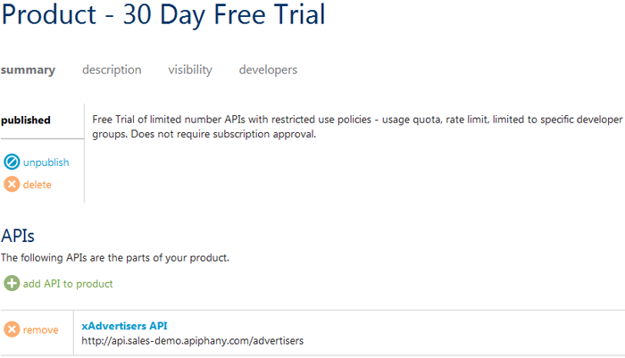
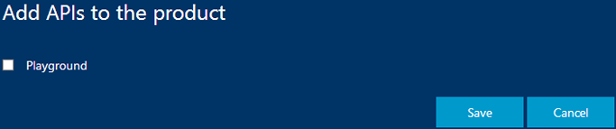
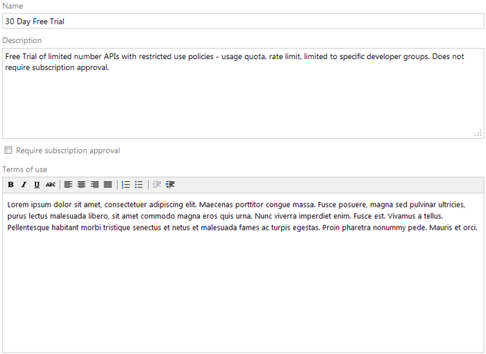
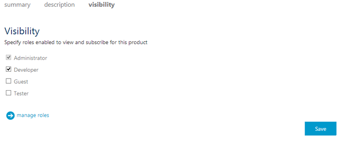
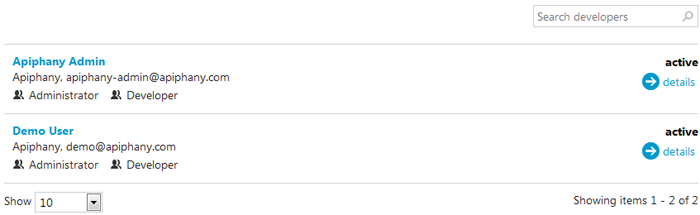

#Tech Note 2: How to publish a product

## Summary
In order to use an API developers have to subscribe to a product containing that API. A product is an abstraction combining one or more API's, a usage quota, and the terms of use. This note explains how to create and publish a product.

## Adding a Product
1. Click on **Products** in the menu on the left.
2. Select **Add product** to display the *Add product* pop up window. 
3. Enter a descriptive name for the product in the *Name* field and a description of the product in the *Description* field.
4. Click **Save** and the new product will be saved in Apiphany.

Note that by default the product will be available to "administrator" and "developer" roles.
 

Click on the product name or on **Configure** to modify the product.
 
### Adding API(s) to a Product
The *Products* page contains four links for configuration: *summary*, *description*, *visibility*, and *developers*.
The *summary* link allows you to set your product to published (available for subscribing) or unpublished.
 

Before publishing your product you need to add one or more APIs. To do this: 

1. Select *add API to the product*. A window will appear in which you can select an API to use.
2. Once complete click **Save**.

### Adding Descriptive Information to a Product
The *Description* link allows you to provide detailed information about the product such as its purpose, the API's it uses, and other useful information. The content for this section can be written in plain text or HTML markup.
 

Select **Require subscription approval** if you want to manually approve all product subscription requests. By default all product subscription are granted automatically.

Optionally fill in the *Terms of use* field describing the terms of use for the product which subscribers must accept in order to use the product.

### Making the Product Visible to Users
The *Visibility* tab allows you to choose which roles are able to view and subscribe to the product.

To enable or disable visibility for a role, click on the check box beside the role and then click on the **Save** button.

### Viewing Subscribers
The *developers* link, lists the developers who have subscribed to the product. The details and settings for each developer can be viewed by clicking on the developer's name or on the *details* link to the right of the developer:

Please provide feedback or request assistance by sending an email to [support@apiphany.com](mailto:support@apiphany.com).