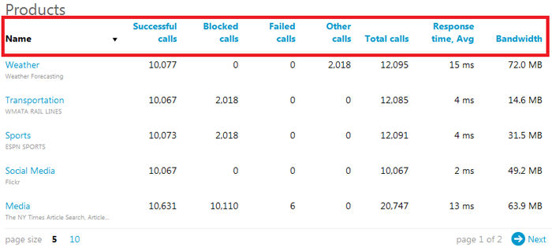
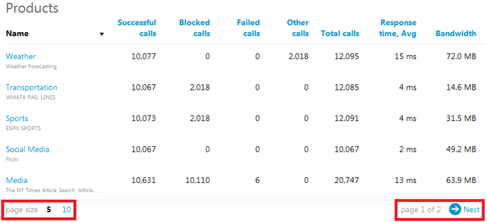
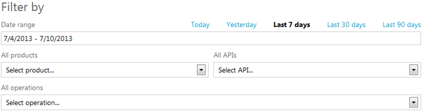

# Tech Note 4: How to View Activity Reports

The activity reports provide aggregated call metrics that are presented by product, API, and individual API operation.

The reports include the following metrics:

- **Successful calls** - the number of calls which returned a successful response (response is considered successful when its status code value is either under 302 or is 304 or 307). 
- **Blocked calls** - the number of calls which were not forwarded to the API due to, for example, an authorization failure or quota violation. 
- **Failed calls** - the number of failed calls (response status code value of 500 and above).
- **Other calls** - the number of calls that don't fall into any of the above categories.
- **Total calls** - the total number of received calls.
- **Response time** - the average response time (in milliseconds).
- **Bandwidth** - the total amount of bandwidth (in megabytes) consumed by the total number of calls.

Each report can be sorted by clicking on the column names:

Default page size is five items (can be switched to ten). If there are more items than the selected page size can hold, then the page navigation buttons in the bottom right hand corner can be used to scroll through pages of results:

##Filtering Report Results
By default the activity reports provide metrics for all products, APIs, and operations for the last seven days. Each of these parameters can be changed by adjusting the respective fields in the *Filter by* controls:

Please provide feedback or request assistance by sending an email to [support@apiphany.com](mailto:support@apiphany.com).
