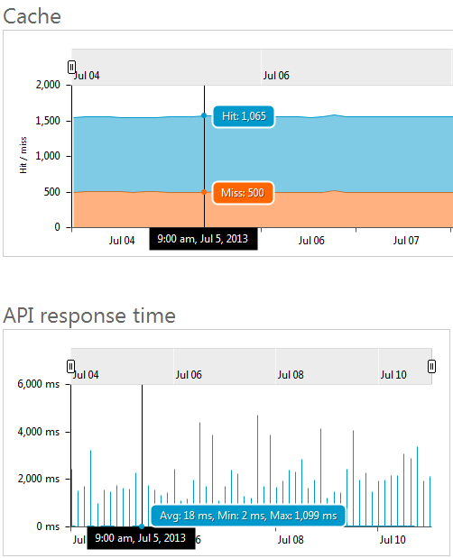

#Tech Note 5: How to View Health Reports

The health reports show a number of performance metrics, for a selected filter, in a graph and on-the-map form. Information displayed on the map matches the time interval selection on the graph. The following reports are included in this group:  

**Status codes** report shows call counts broken into four groups according to the response status codes: successful, blocked, failed, and other. *Successful* calls have status code values under `302` or equal `304` or `307`. *Blocked* calls are the calls that have not been forwarded to the API due to, for example, authorization failure or quota violation. *Failed* calls are the ones with status codes of `500` and above. All remaining calls are counted in the *Other* group.  

**Cache** report displays cache hit and miss counts for calls made to the APIs and operations with caching enabled.  

**API response time** report uses a candlestick chart to show the average, minimum, and maximum response times (in milliseconds). These values include both the time spent in the Apiphany proxy (including cache lookup, if applicable) and the roundtrip and the time spent in the API service itself. Average values are represented by the horizontal tick marks. Minimums and maximums are designated by the lowest and highest points of every "candlestick".  

**Service response time** report uses a candlestick chart to show the average, minimum, and maximum API service response times (in milliseconds). These values include the roundtrip to the API service and the time spent in it. Average values are represented by the horizontal tick marks. Minimums and maximums are designated by the lowest and highest points of every "candlestick".

**Time in proxy** report uses a candlestick chart to show the average, minimum, and maximum amount of time spent in the Apiphany proxy (in milliseconds). Average values are represented by the horizontal tick marks. Minimums and maximums are designated by the lowest and highest points of every "candlestick".

##Filtering Report Results
By default the health reports provide metrics for all of your products, APIs, and operations over the last seven days. Each of these parameters can be changed by adjusting the respective fields in the *Filter by* controls:

##Comparing Graphs

As the cursor is hovered over any of the graphs, specific metric values are shown for a time interval highlighted by the vertical line. Time interval length varies from 15 minutes to 3 hours to 12 hours, depending on whether the date range is set to Today/Yesterday, Last 7 Days, or Last 30/90 Days respectively. Moreover, the same time interval is highlighted on all other report graphs for comparison and correlation purposes.

The following screen shot shows how hovering the mouse over the *Cache* graph shows cache hits and misses, while the API response time shows the corresponding response time metrics. 

Please provide feedback or request assistance by sending an email to [support@apiphany.com](mailto:support@apiphany.com).
