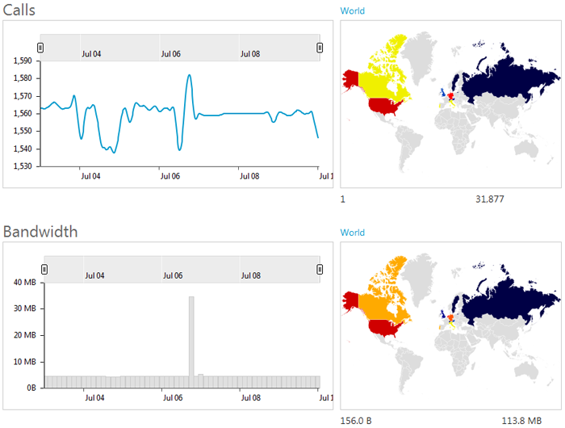
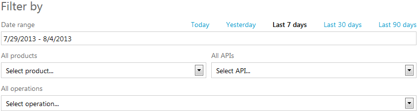
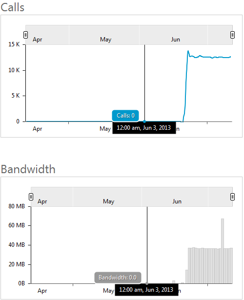

# Tech Note 6: Usage Reports

The usage reports show the total number of calls made and the bandwidth consumed by those calls, for a selected filter, in both graph and on-the-map form. Information displayed on the map matches the time interval selected on the graph.

#Filtering Report Results
By default the health reports provide metrics for all of your products, APIs, and operations over the last seven days. Each of these parameters can be changed by adjusting the respective fields in the *Filter by* controls:

#Comparing Graphs

As the cursor is hovered over any of the graphs, specific metric values are shown for a time interval highlighted by the vertical line. Time interval length varies from 15 minutes to 3 hours to 12 hours, depending on whether the date range is set to Today/Yesterday, Last 7 Days, or Last 30/90 Days respectively. Moreover, the same time interval is highlighted on both graphs at the same time for comparison and correlation purposes.

Please provide feedback or request assistance by sending an email to [support@apiphany.com](mailto:support@apiphany.com).
