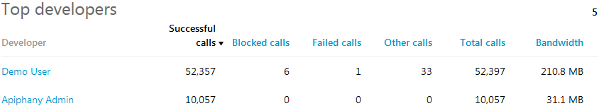
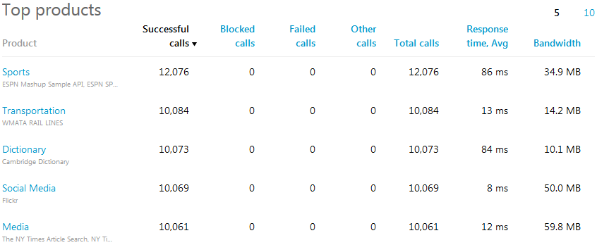
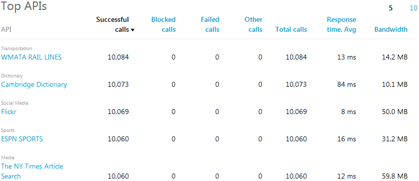
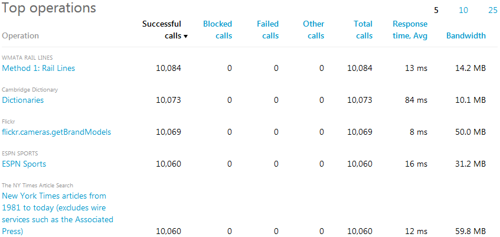
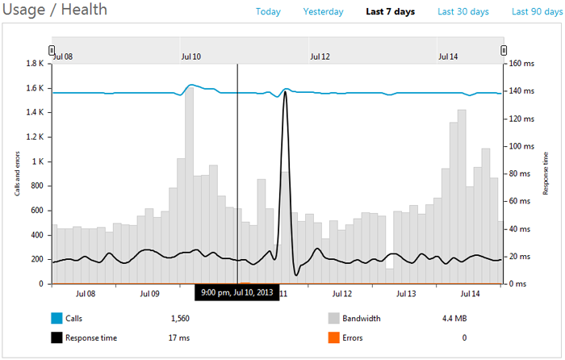

#Tech Note 7: At a Glance Reports

The *at a glance* reports summarize key information related to API usage and performance. Reports show data for a number of preset time intervals: today, yesterday, last 7 days, last 30 days, and last 90 days. The following reports are included in this category:  

**Usage/Health** report displays call volume, bandwidth consumption, average response time, and error count on the same graph. See [below](#usage-health-graph) for details.

**Top developers** report lists the most active developers, in descending order, as measured by the total number of successful calls made by them during the selected time period:
   
  

**Top products** report lists the most popular API products, in descending order, as measured by the number of successful calls made to the APIs comprising them over the selected time period:

 
 **Top APIs** report lists the most heavily used APIs, in descending order, as measured by the number of successful calls made to them during the selected time period:
    

**Top operations** report lists the most frequently invoked API operations, in descending order, as measured by the number of successful calls made to them in the selected time period:

Note, that each of the "top" reports can be sorted (in descending order only) by any other column by clicking on the desired column's header.
 
##Using the Usage/Health Graph

Metrics for response time, calls, and errors are drawn as line graphs overlaid on top of a bar graph representing bandwidth consumption. This display makes for easy comparison and correlation between these metrics.

As the mouse pointer is moved within the Usage/Health graph, the metric values are shown below the graph, aggregated over intervals of either 15 minutes, 3 hours, or 12 hours, depending on whether the date range is set to Today/Yesterday, Last 7 Days, or Last 30/90 Days respectively.

Please provide feedback or request assistance by sending an email to [support@apiphany.com](mailto:support@apiphany.com).